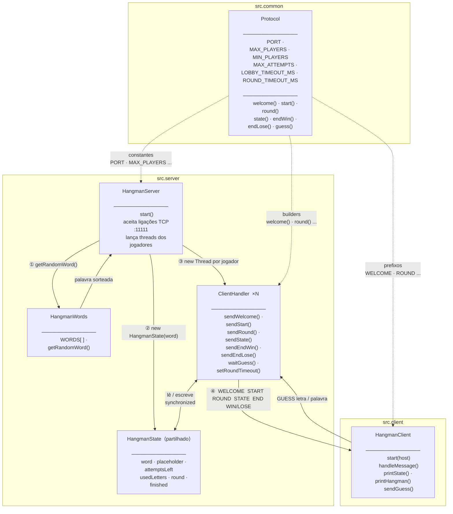

# Diagrama de Fluxo — Hangman Multijogador



---

## Fluxo de mensagens TCP

```mermaid
sequenceDiagram
    actor J as Jogador
    participant HC as HangmanClient
    participant CH as ClientHandler
    participant STATE as HangmanState

    J->>HC: liga (java HangmanClient)
    HC->>CH: TCP connect :11111

    Note over CH: aguarda MIN_PLAYERS<br/>ou LOBBY_TIMEOUT

    CH-->>HC: WELCOME &lt;id&gt; &lt;total&gt;

    loop cada ronda
        CH-->>HC: ROUND &lt;k&gt; &lt;mask&gt; &lt;attempts&gt; &lt;usedLetters&gt;
        HC->>J: mostra estado + forca
        J->>HC: escreve letra ou palavra
        HC->>CH: GUESS &lt;texto&gt;
        CH->>STATE: valida guess · atualiza estado
        CH-->>HC: STATE &lt;mask&gt; &lt;attempts&gt; &lt;usedLetters&gt;
    end

    alt palavra adivinhada
        CH-->>HC: END WIN &lt;winnerIds&gt; &lt;word&gt;
    else tentativas esgotadas
        CH-->>HC: END LOSE &lt;word&gt;
    end
```

---

## Legenda das classes

| Classe | Pacote | Responsabilidade |
|---|---|---|
| `HangmanServer` | `src.server` | Arranca o servidor, aceita jogadores, lança threads |
| `ClientHandler` | `src.server` | Thread por jogador — envia/recebe mensagens, acede ao estado |
| `HangmanState` | `src.server` | Estado partilhado e sincronizado do jogo |
| `HangmanWords` | `src.server` | Banco de palavras, sorteia palavra aleatória |
| `Protocol` | `src.common` | Constantes e builders de mensagens do protocolo |
| `HangmanClient` | `src.client` | Cliente de terminal — mostra jogo e lê input do jogador |
